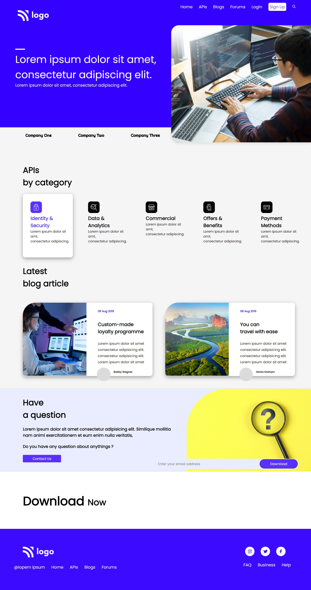

# Developer-Landingpage

 

### Project live at
- [Link](https://developer-landingpage-website.netlify.app/)

### Skills acquired from this project
1. To Position images in complex layout.

### Time Taken to build website
- 8 hours

### Screenshot

